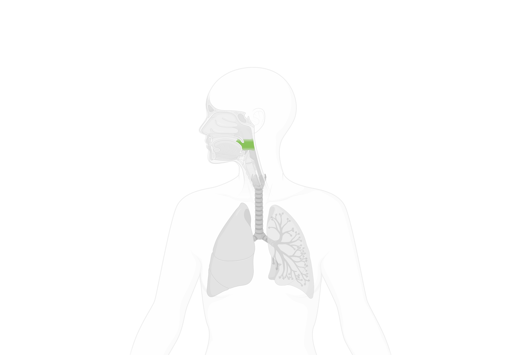
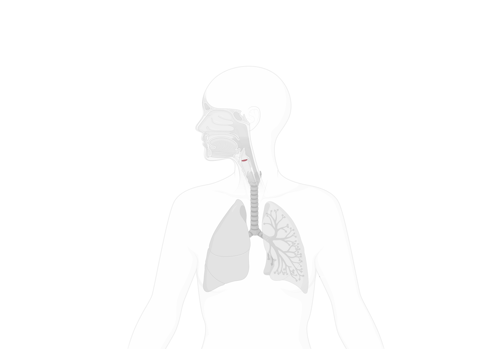
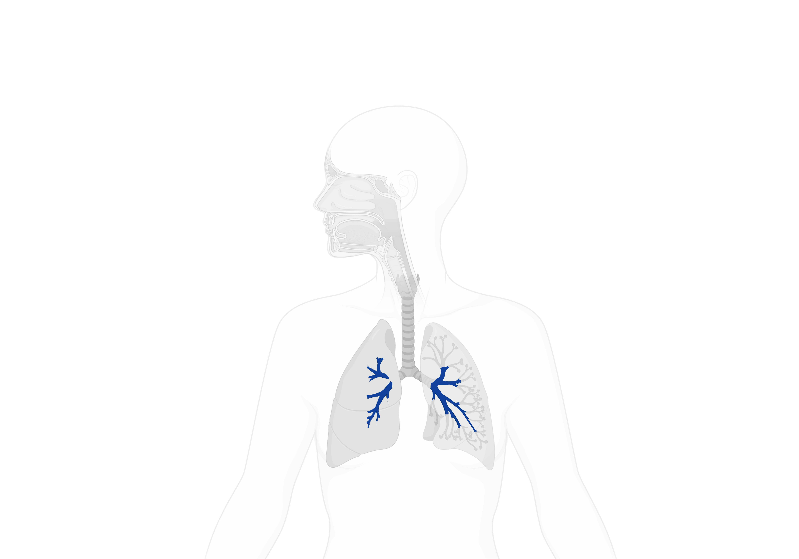
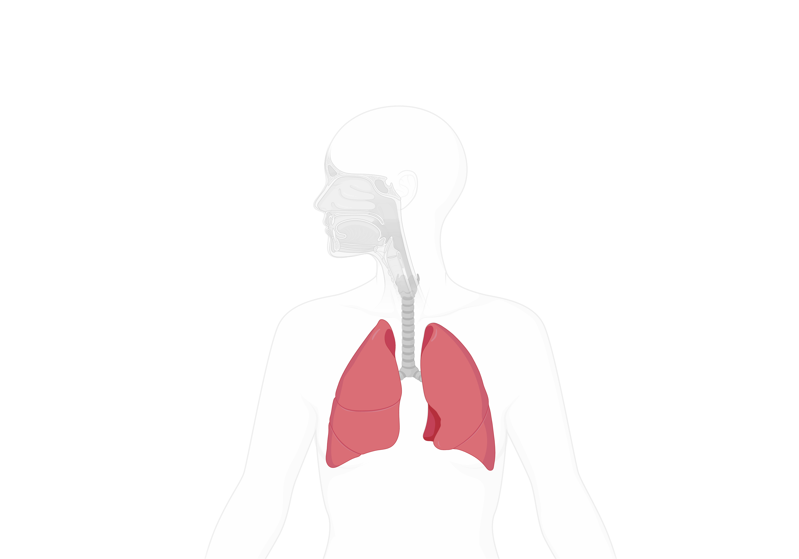
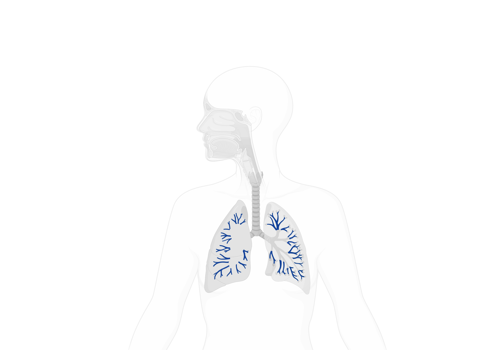
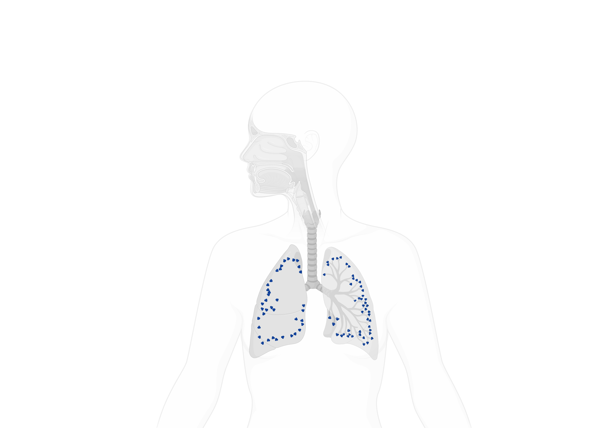

<!--  -->

<map name="Map" id="Map">
<!-- Nose -->
<!-- <area onclick="linFkTo('Nasal cavity', 'Nose and pharynx')" onmouseover="update('Nose', 'Nasal cavity')" -->
<area onclick="linkTo('Nasal cavity', 'Nose and pharynx')" onmouseover="update('Nose', 'Nasal cavity')"
title="Nasal cavity" coords="2788,1397,2751,1344,2587,1334,2514,1340,2380,1519,2469,1519,2525,1553,2793,1564"
shape="poly">
<area onclick="linkTo('Nostrils', 'Nose and pharynx')" onmouseover="update('Nose', 'Nostrils')" title="Nostrils"
coords="2492,1566,2413,1533,2413,1588" shape="poly">

<!-- Pharynx -->
<area onclick="linkTo('Nasal pharynx', 'Nose and pharynx')" o nmouseover="update('Pharynx', 'Nasal pharynx')"
title="Nasal pharynx" coords="2816,1441,2872,1474,2939,1497,2994,1642,2860,1631,2793,1564" shape="poly">
<area onclick="linkTo('Oropharynx', 'Nose and pharynx')" onmouseover="update('Pharynx', 'Oropharynx')"
title="Oropharynx" coords="2793,1671,2838,1738,2983,1716,2983,1649,2849,1638" shape="poly">
<area onclick="linkTo('Hypopharynx', 'Nose and pharynx')" onmouseover="update('Pharynx', 'Hypopharynx')"
title="Hypopharynx"
coords="3127,2169,3095,2185,3005,1904,2958,1861,2931,1782,2883,1824,2836,1803,2857,1750,2984,1739"
shape="poly">

<!-- Larynx -->
<area onclick="linkTo('Larynx')" onmouseover="update('Larynx')" title="Larynx"
coords="2905,1941,2942,1941,2973,1914,2920,1909" shape="poly">

<!-- Airway -->
<area onclick="linkTo('Trachea', 'Airway')" onmouseover="update('Airway', 'Trachea')" title="Trachea"
coords="3006,2748,3106,2748,3095,2212,2994,2223" shape="poly">
<area onclick="linkTo('Primary bronchus', 'Airway')" onmouseover="update('Airway', 'Primary bronchus')"
title="Primary bronchus"
coords="2994,2764,2950,2808,2961,2875,3017,2819,3095,2831,3207,2898,3251,2831,3117,2764" shape="poly">
<area onclick="linkTo('Bronchi', 'Airway')" onmouseover="update('Airway', 'Bronchi')" title="Bronchi"
coords="3240,2848,3296,2804,3307,2737,3363,2759,3419,2837,3441,2904,3408,3005,3508,3150,3430,3172,3341,3116,3240,3005"
shape="poly">

<!-- Lung -->
<area onclick="linkTo('all', 'Lung')" onmouseover="update('Lung')" title="Lung"
coords="2849,2399,2626,2690,2503,2969,2436,3461,2469,3505,2682,3416,2950,3315,2994,3215,2972,3025,3006,2902,2916,2846,2894,2734,2961,2701,2961,2545,2916,2411"
shape="poly">
<area onclick="linkTo('Bronchioles', 'Lung')" onmouseover="update('Lung', 'Bronchioles')" title="Bronchioles"
coords="3263,2721,3330,2710,3397,2755,3430,2833,3453,2911,3441,2978,3475,3056,3520,3146,3441,3179,3229,3034,3263,3112,3341,3168,3520,3235,3587,3235,3531,3079,3497,2799,3397,2676,3307,2554,3240,2609,3196,2676"
shape="poly">
<area onclick="linkTo('Alveoli', 'Lung')" onmouseover="update('Lung', 'Alveoli')" title="Alveoli"
coords="3184,2699,3207,2598,3251,2542,3318,2531,3385,2576,3419,2654,3453,2732,3520,2777,3531,2855,3542,2933,3542,3034,3587,3123,3609,3190,3620,3257,3553,3268,3453,3235,3363,3213,3296,3146,3229,3101,3218,3179,3263,3246,3330,3313,3397,3324,3475,3347,3564,3369,3631,3358,3687,3302,3676,3190,3631,3045,3620,2944,3587,2822,3542,2676,3464,2576,3385,2486,3229,2419,3151,2565"
shape="poly">
</map>
<!--  -->

<!-- 各个器官独立的图层 -->

<!-- 鼻部全图层 -->

<!-- 独立器官图层 -->

<!-- 喉部全图层 -->

<!-- 独立器官图层 -->

<!-- 鼻部全图层 -->

<!-- 气道全图层 -->

<!-- 独立器官图层 -->

<!-- 肺部全图层 -->

<!-- 独立器官图层 -->

<!-- <ul class="lung-nav">
<li class="nav" id="nav_1" onclick="linkTo('Nose')" onmouseover="update('Nose')"
:class="activeBrain == 'Nose' ? 'actived' : ''">Nose</li>
<li class="nav" id="nav_2" onclick="linkTo('Pharynx')" onmouseover="update('Pharynx')"
:class="activeBrain == 'Pharynx' ? 'actived' : ''">Pharynx</li>
<li class="nav" id="nav_3" onclick="linkTo('Airway')" onmouseover="update('Airway')"
:class="activeBrain == 'Airway' ? 'actived' : ''">Airway</li>
<li class="nav" id="nav_4" onclick="linkTo('Lung')" onmouseover="update('Lung')"
:class="activeBrain == 'Lung' ? 'actived' : ''">Lung</li>
<li class="nav" id="nav_Larynx" onclick="linkTo('Larynx')" onmouseover="update('Larynx')"
:class="activeBrain == 'Larynx' ? 'actived' : ''">Larynx</li>
</ul> -->

<ul class="lung-nav">
  <li class="nav" id="nav_1" onclick="linkTo('Nose')" onmouseover="update('Nose')" 
  :class="activeBrain == 'Nose' ? 'actived' : ''">Nose</li>
  <li class="nav" id="nav_2" onclick="linkTo('Pharynx')" onmouseover="update('Pharynx')" 
  :class="activeBrain == 'Pharynx' ? 'actived' : ''">Pharynx</li>
  <li class="nav" id="nav_3" onclick="linkTo('Airway')" onmouseover="update('Airway')" 
  :class="activeBrain == 'Airway' ? 'actived' : ''">Airway</li>
  <li class="nav" id="nav_4" onclick="linkTo('Lung')" onmouseover="update('Lung')" 
  :class="activeBrain == 'Lung' ? 'actived' : ''">Lung</li>
  <li class="nav" id="nav_Larynx" onclick="linkTo('Larynx')" onmouseover="update('Larynx')" 
  :class="activeBrain == 'Larynx' ? 'actived' : ''">Larynx</li>
</ul>

<!-- Sub-navigation for specific organs if needed -->

<ul class="lung-nav nose-nav">
<li v-for="(item, index) in noseNav" :key="item"
  :class="(`nav_1_${index}`) + ' ' + (activedLabel(item) ? 'actived ' : '')" onclick="linkTo(item)"
  onmouseover="update('Nose', item)">{{ item }}</li>
</ul>

<ul class="lung-nav pharynx-nav">
<li v-for="(item, index) in pharynxNav" :key="item"
  :class="(`nav_2_${index}`) + ' ' + (activedLabel(item) ? 'actived ' : '')" onclick="linkTo(item)"
  onmouseover="update('Pharynx', item)">{{ item }}</li>
</ul>

<ul class="lung-nav airway-nav">
<li v-for="(item, index) in airwayNav" :key="item"
  :class="(`nav_3_${index}`) + ' ' + (activedLabel(item) ? 'actived ' : '')" onclick="linkTo(item)"
  onmouseover="update('Airway', item)">{{ item }}</li>
</ul>

<ul class="lung-nav lungsub-nav">
<li v-for="(item, index) in lungSubNav" :key="item"
  :class="(`nav_4_${index}`) + ' ' + (activedLabel(item) ? 'actived ' : '')" onclick="linkTo(item)"
  onmouseover="update('Lung', item)">{{ item }}</li>
</ul>

